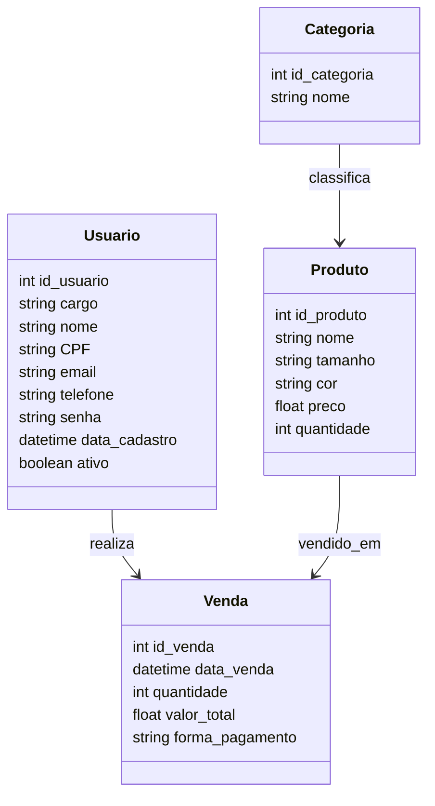

# 🧾 API - Loja de Roupas Física

Trabalho final da turma **FS44 - Digital College**

---

## 📦 Sistema de Vendas

Este projeto representa o **modelo conceitual de um sistema de vendas**, contendo **4 entidades principais**:

- 👕 **Produto**  
- 🧍 **Usuário**  
- 💰 **Venda**  
- 🏷️ **Categoria**

---

## 🗄️ Estrutura do Banco de Dados (MySQL)

```sql
-- ==========================================================
--  🚀 CONFIGURAÇÃO INICIAL
-- ==========================================================
DROP DATABASE IF EXISTS loja_roupas;
CREATE DATABASE IF NOT EXISTS loja_roupas;
USE loja_roupas;

-- ==========================================================
-- 🧍 TABELA DE USUÁRIOS
-- ==========================================================
CREATE TABLE tb_usuarios (
  id_usuario INT AUTO_INCREMENT PRIMARY KEY,
  nome VARCHAR(100) NOT NULL,
  cargo ENUM('vendedor', 'dono') DEFAULT 'vendedor',
  cpf VARCHAR(14) UNIQUE,
  email VARCHAR(100) UNIQUE NOT NULL,
  telefone VARCHAR(20),
  senha VARCHAR(255) NOT NULL,
  ativo BOOLEAN DEFAULT TRUE,
  data_cadastro TIMESTAMP DEFAULT CURRENT_TIMESTAMP
);

-- ==========================================================
-- 👕 TABELA DE PRODUTOS
-- ==========================================================
CREATE TABLE tb_produtos (
  id_produto INT AUTO_INCREMENT PRIMARY KEY,
  nome VARCHAR(100) NOT NULL,
  tamanho VARCHAR(10),
  cor VARCHAR(30),
  categoria VARCHAR(50),
  preco DECIMAL(10,2) NOT NULL,
  estoque INT DEFAULT 0,
  data_cadastro TIMESTAMP DEFAULT CURRENT_TIMESTAMP
);

-- ==========================================================
-- 💰 TABELA DE VENDAS
-- ==========================================================
CREATE TABLE tb_vendas (
  id_venda INT AUTO_INCREMENT PRIMARY KEY,
  id_usuario INT NOT NULL,
  data_venda DATETIME DEFAULT CURRENT_TIMESTAMP,
  forma_pagamento ENUM('dinheiro', 'pix') NOT NULL,
  FOREIGN KEY (id_usuario) REFERENCES tb_usuarios(id_usuario)
);

-- ==========================================================
-- 🧾 TABELA DE ITENS DE VENDA
-- ==========================================================
CREATE TABLE tb_itens_venda (
  id_item INT AUTO_INCREMENT PRIMARY KEY,
  id_venda INT NOT NULL,
  id_produto INT NOT NULL,
  quantidade INT NOT NULL,
  preco_unitario DECIMAL(10,2) NOT NULL,
  FOREIGN KEY (id_venda) REFERENCES tb_vendas(id_venda),
  FOREIGN KEY (id_produto) REFERENCES tb_produtos(id_produto)
);

-- ==========================================================
-- 🏷️ TABELA DE CATEGORIAS
-- ==========================================================
CREATE TABLE IF NOT EXISTS tb_categorias (
  id_categoria INT AUTO_INCREMENT PRIMARY KEY,
  nome VARCHAR(100) NOT NULL,
  criado_em TIMESTAMP DEFAULT CURRENT_TIMESTAMP
);

## 📊 Diagrama de Classes



⚙️ Instalação e Execução
🔧 Pré-requisitos

Certifique-se de ter instalado em sua máquina:

Node.js (versão 18 ou superior)
MySQL
Git

🪜 Passos para rodar o projeto localmente

--- Clonar o repositório

git clone https://github.com/ronneyrv/loja-de-roupas-fisica.git


--- Acessar a pasta do projeto

cd loja-de-roupas-fisica


--- Instalar as dependências

npm install


--- Configurar o banco de dados

Acesse o MySQL e execute o script SQL mostrado acima (ou o arquivo db.sql).

Crie um arquivo .env na raiz do projeto com suas credenciais do banco:

DB_HOST=localhost
DB_USER=root
DB_PASSWORD=sua_senha
DB_NAME=loja_roupas
PORT=3000


--- Iniciar o servidor

node server.js


--- Acessar a API

Acesse em: http://localhost:3000

Documentação Swagger: http://localhost:3000/api-docs