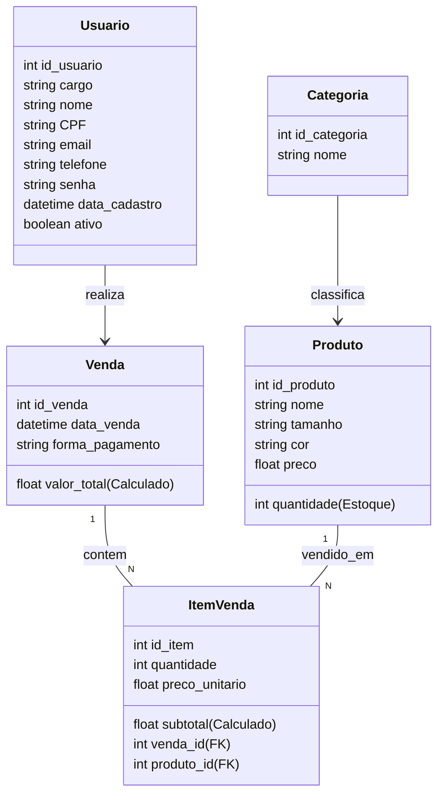

# 🧾 API - Loja de Roupas Física

Trabalho final da turma **FS44 - Digital College**

---

## 📦 Sistema de Vendas

Este projeto representa o **modelo conceitual de um sistema de vendas**, contendo **4 entidades principais**:

- 👕 **Produto**  
- 🧍 **Usuário**  
- 💰 **Venda**  
- 🏷️ **Categoria**

---

## Diagrama de Classes



---

## API REST

```mermaid
graph TD
    A[Cliente Frontend] --> B{Requisicao HTTP};

    subgraph API_REST_NodeJS_Express
        B --> C[Router];
        C --> D[Controller];
        D --> F[Model Acesso DB];
        F --> G[(Banco de Dados MySQL)];
    end

    G --> F;
    F --> D;
    D --> H[Resposta JSON];

    H --> A;

    style A fill:#F0F0F0,stroke:#666
    style G fill:#E8E8E8,stroke:#666
    style C fill:#F8F8F8,stroke:#666
    style D fill:#F8F8F8,stroke:#666
    style F fill:#F8F8F8,stroke:#666
    style H fill:#F0F0F0,stroke:#666