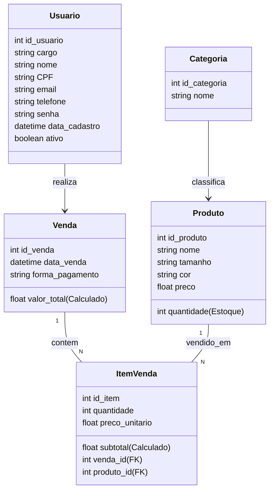
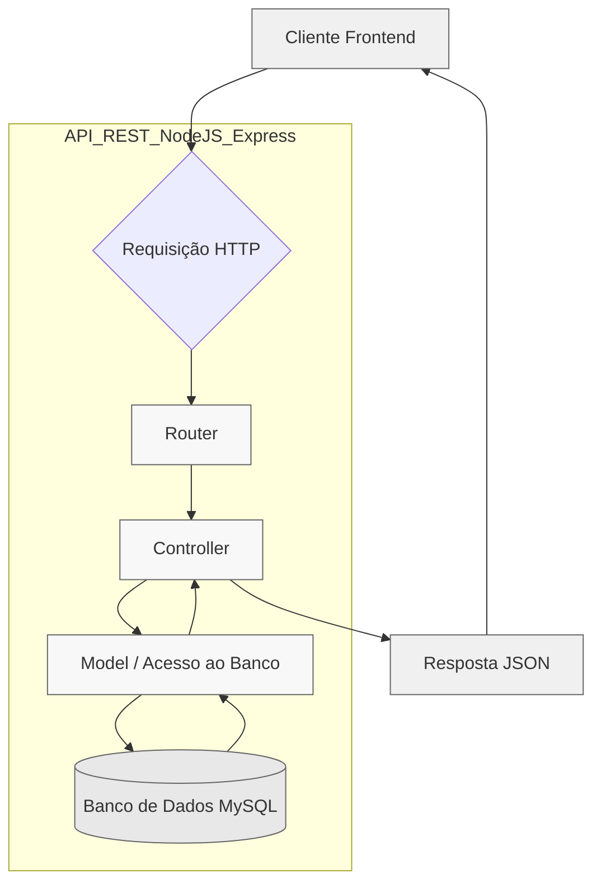

# 🧾 API - Loja de Roupas Física

Trabalho final da turma **FS44 - Digital College**

---

## 🧱 Stack do Sistema

O sistema foi desenvolvido utilizando uma **stack moderna e eficiente**, combinando ferramentas que garantem **desempenho, segurança e fácil manutenção**.

- 🧠 **JavaScript (ES6+)** — Linguagem principal do projeto.
- ⚙️ **Node.js** — Ambiente de execução JavaScript no backend.  
- 🚀 **Express.js** — Framework para criação de rotas e controle da API.  
- 🗄️ **MySQL** — Banco de dados relacional para armazenamento das informações.  
- 🧾 **Swagger (OpenAPI)** — Documentação interativa da API.  
- 📊 **Mermaid** — Geração de diagramas e visualização de modelos conceituais.  
- 🧑‍💻 **Git + GitHub** — Controle de versão e hospedagem do código-fonte.

---

## 📦 Sistema de Vendas

Este projeto representa o **modelo conceitual de um sistema de vendas**, contendo **5 entidades principais**:

- 👕 **Produto**  
- 🧍 **Usuário**  
- 💰 **Venda**
- 🧾 **Item de Venda**
- 🏷️ **Categoria**

---

## Diagrama de Classes



---

## API REST

A API segue o padrão RESTful, com endpoints organizados por recurso, como usuários, produtos, vendas, itens de venda e categorias.


Cada camada possui responsabilidade clara dentro da arquitetura:

- 🛣️ **Router** → Define as rotas e métodos HTTP disponíveis (GET, POST, PUT, DELETE).

- 🧩 **Controller** → Processa as requisições e interage com os modelos de dados.

- 💾 **Model** → Realiza a comunicação direta com o banco de dados MySQL.

- 🗄️ **Banco de Dados (MySQL)** → Armazena todas as informações estruturadas da aplicação.


## O fluxo básico é:

→ O cliente envia uma requisição HTTP à API.

→ O Router direciona a requisição ao Controller correto.

→ O Controller consulta ou modifica os dados via Model.

→ O Model interage com o banco MySQL.

→ A resposta é retornada em formato JSON, pronta para o consumo pelo frontend.




---

## Arquitetura do Sistema

```bash
📦 /api-loja-roupas
├── 📁 /docs/                   # 📘 Documentação da API (openapi.yaml)
├── 📁 /node_modules/
├── 📁 /src/
│   ├── 📁 /connection/
│   │   └── ⚙️ database.js       # 🔌 Conexão com o MySQL
│   ├── 📁 /controller/          # 🧠 Regras de negócio e respostas às requisições
│   ├── 📁 /router/              # 🚦 Define as URIs e associa aos Controllers
│   ├── 📁 /model/               # 🗃️ Estrutura de interação com o DB (SQL)
│   └── 📁 /utils/
│       └── 🧩 db.sql            # 📄 Desenho das tabelas utilizadas no sistema
├── ⚙️ .env                      # 🌍 Variáveis de ambiente (porta, DB, JWT Secret)
├── ⚙️ .env.example
├── 🙈 .gitignore
├── 🧭 discovery.md
├── 📦 package-lock.json
├── 📦 package.json
├── 📘 README.md
└── 🚀 server.js                 # 🏁 Ponto de entrada da aplicação (Express)
